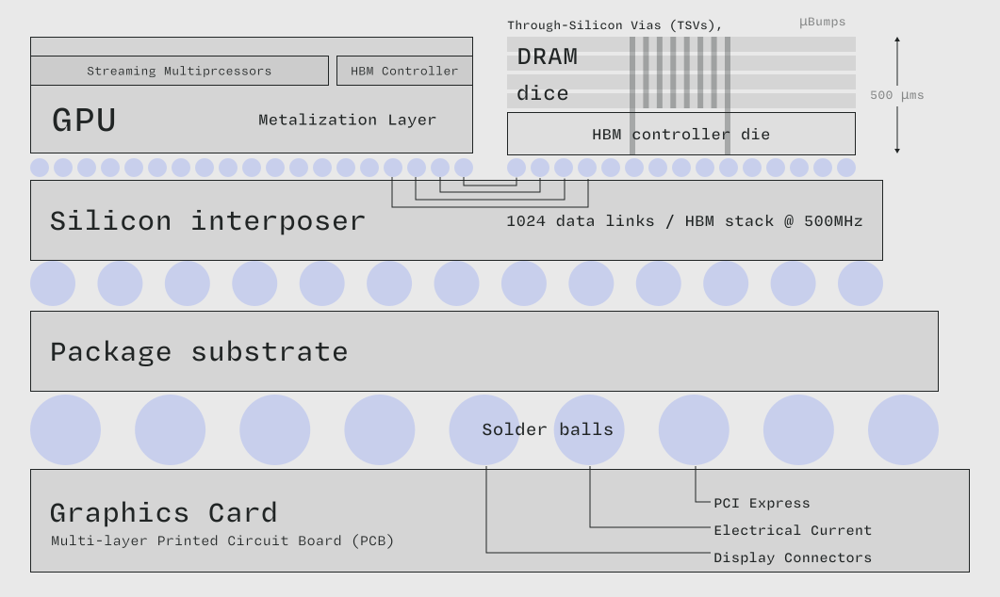

# 什么是 GPU RAM？

  

> 在像 H100 这样的高性能数据中心 GPU 中，RAM 位于与处理器芯片相邻的芯片上。改编自维基百科关于[高带宽内存](https://en.wikipedia.org/wiki/High_Bandwidth_Memory)的页面。]

GPU 的底层存储器是一个大容量（数兆字节到数千兆字节）的存储空间，可被 GPU 的所有[流式多处理器 (SM)](/gpu-glossary/device-hardware/streaming-multiprocessor) 寻址。

它也被称为 GPU RAM（随机存取存储器）或显存 (VRAM)。它使用动态 RAM (DRAM) 单元，比[寄存器文件](/gpu-glossary/device-hardware/register-file)和[一级数据缓存](/gpu-glossary/device-hardware/l1-data-cache)中使用的静态 RAM (SRAM) 速度更慢但体积更小。有关 DRAM 和 SRAM 的详细信息，我们推荐 Ulrich Drepper 2007 年的文章["程序员应了解的内存知识"](https://people.freebsd.org/~lstewart/articles/cpumemory.pdf)。

它通常不与[流式多处理器 (SM)](/gpu-glossary/device-hardware/streaming-multiprocessor) 位于同一芯片上，不过在最新的数据中心级 GPU（如 H100）中，它位于共享的[中介层](https://en.wikipedia.org/wiki/Interposer)上，以降低延迟并提高[内存带宽](/gpu-glossary/perf/memory-bandwidth)。这些 GPU 使用[高带宽内存 (HBM)](https://en.wikipedia.org/wiki/High_Bandwidth_Memory) 技术，而不是消费级 GPU 和 CPU 中更常见的双倍数据速率 (DDR) 内存。

RAM 用于实现[CUDA 编程模型](/gpu-glossary/device-software/cuda-programming-model)的[全局内存](/gpu-glossary/device-software/global-memory)，并存储从[寄存器文件](/gpu-glossary/device-hardware/register-file)溢出的[寄存器](/gpu-glossary/device-software/registers)数据。

H100 可以在其 RAM 中存储 80 GiB (687,194,767,360 位)。