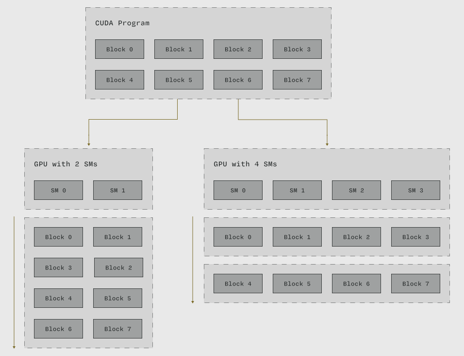

# 什么是 CUDA 编程模型？

CUDA 全称是 _Compute Unified Device Architecture_（统一计算设备架构）。  
根据上下文的不同，"CUDA" 可以指代多个不同的概念：
一种 [设备硬件架构](/gpu-glossary/device-hardware/cuda-device-architecture)，或是一种适用于该架构设计的 [并行编程模型](/gpu-glossary/device-software/cuda-programming-model)，或是一种扩展高级语言（如 C 语言）以支持该编程模型的 [软件平台](/gpu-glossary/host-software/cuda-software-platform)。

CUDA 的愿景在 [Lindholm 等人于 2008 年](https://www.cs.cmu.edu/afs/cs/academic/class/15869-f11/www/readings/lindholm08_tesla.pdf) 发布的白皮书中有所阐述。我们强烈推荐阅读这份论文，它是 NVIDIA 文档中许多观点、图表乃至特定表述的原始出处。

本文，重点介绍 CUDA _编程模型_。

统一计算设备架构 (CUDA) 编程模型是一种用于大规模并行处理器的编程模型。

根据 [英伟达 CUDA C++ 编程指南](https://docs.nvidia.com/cuda/cuda-c-programming-guide/#a-scalable-programming-model)， CUDA 编程模型包含三个关键抽象：

- [**线程组层次结构**](/gpu-glossary/device-software/thread-hierarchy)。
  程序以线程方式执行，但可按嵌套层次引用线程组，从 [线程块](/gpu-glossary/device-software/thread-block) 到 [线程块网格](/gpu-glossary/device-software/thread-block-grid)。
- [**存储器层次结构**](/gpu-glossary/device-software/memory-hierarchy)。
  层次结构中每个级别的线程组都能访问特定的内存资源，以便在组内进行通信。访问存储器层次结构中的 [最底层](/gpu-glossary/device-software/shared-memory) 时，其速度应 [几乎与执行指令一样快](/gpu-glossary/device-hardware/l1-data-cache)。
- **屏障同步**。线程组可通过屏障实现执行协调。

线程组和存储器的层次结构及其到 [设备硬件](/gpu-glossary/device-hardware/index.rst) 的映射总结在下图中。

> 左图：CUDA 编程模型的抽象线程组和存储器层次结构。右图：实现这些抽象概念的匹配硬件。修改自英伟达的 [CUDA Refresher: The CUDA Programming Model](https://developer.nvidia.com/blog/cuda-refresher-cuda-programming-model/) 和英伟达 [CUDA C++ Programming Guide](https://docs.nvidia.com/cuda/cuda-c-programming-guide/index.html#programming-model) 中的图表。

这三个抽象概念共同鼓励以一种能够随着 GPU 设备并行执行资源的扩展而透明扩展的方式来表达程序。

更具挑战性地说：这种编程模型可防止程序员为 NVIDIA [CUDA 架构](/gpu-glossary/device-hardware/cuda-device-architecture) GPU 编写的程序在用户购买新NVIDIA GPU 时无法获得加速的程序。

例如，CUDA 程序中的每个 [线程块](/gpu-glossary/device-software/thread-block) 都可以进行紧密协调，但块间协调受到限制。这确保线程块能够捕捉程序的可并行化组件，并且可以按任意顺序调度——用计算机体系结构的术语来说，程序员将这种并行性"暴露"给了编译器和硬件。当程序在具有更多调度单元（具体而言是更多 [流式多处理器 (Streaming Multiprocessor)](/gpu-glossary/device-hardware/streaming-multiprocessor)） 的新 GPU 上执行时，更多此类线程块可以并行执行。

> 一个包含八个 [线程块](/gpu-glossary/device-software/thread-block) 的 CUDA 程序在两个 [流式多处理器 (SM)](/gpu-glossary/device-hardware/streaming-multiprocessor) 的 GPU 上分四个顺序步骤（波次）运行，但在拥有两倍数量 [SM](/gpu-glossary/device-hardware/streaming-multiprocessor) 的 GPU 上，只需一半步骤即可完成。修改自 [CUDA 编程指南](https://docs.nvidia.com/cuda/cuda-c-programming-guide/)。

CUDA 编程模型的抽象概念通过扩展高级 CPU 编程语言（例如[C++ 的 CUDA C++ 扩展](/gpu-glossary/host-software/cuda-c)）的方式提供给程序员。 该编程模型在软件层面通过指令集架构 [（并行线程执行，即 PTX）](/gpu-glossary/device-software/parallel-thread-execution) 和低级汇编语言 [（流式汇编器，即 SASS）](/gpu-glossary/device-software/streaming-assembler) 来实现。例如，[线程层次结构](/gpu-glossary/device-software/thread-hierarchy) 中的 [线程块](/gpu-glossary/device-software/thread-block) 级别通过这些语言中的 [协作线程数组 (cooperative thread array)](/gpu-glossary/device-software/cooperative-thread-array) 来实现的。