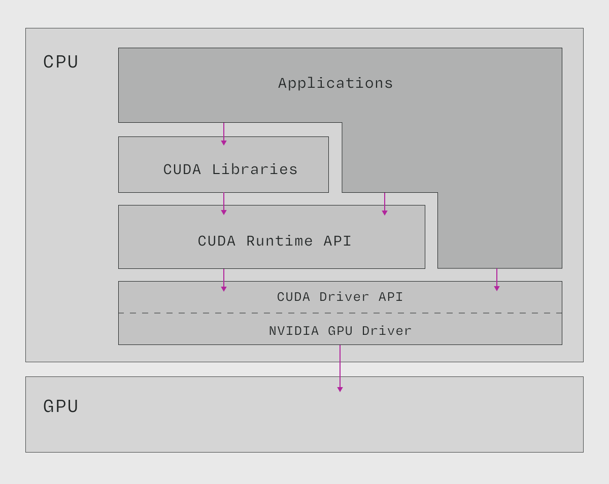

# 什么是 CUDA Runtime API？

CUDA 运行时 API (CUDA Runtime API) 是对 CUDA 驱动 API [CUDA Driver API](/gpu-glossary/host-software/cuda-driver-api) 的封装，为相同的功能提供了更高级别的编程接口。

  

> CUDA 工具包。CUDA Runtime API 封装了 CUDA Driver API，使其更适合应用程序编程。改编自《Professional CUDA C Programming Guide》。

通常更推荐使用运行时 API 而非 [驱动 API](/gpu-glossary/host-software/cuda-driver-api)，因为使用体验更友好。 但在内核启动控制和上下文管理方面存在一些细微限制。更多信息请参阅 CUDA Runtime API 文档的 [此章节](https://docs.nvidia.com/cuda/cuda-runtime-api/driver-vs-runtime-api.html#driver-vs-runtime-api)。

虽然根据 [NVIDIA CUDA 工具包 EULA 的附件 A](https://docs.nvidia.com/cuda/eula/index.html#attachment-a)， 运行时 API 可以静态链接，但这不是必须的。在 Linux 系统上，用于动态链接的共享对象文件通常名为 [libcudart.so](/gpu-glossary/host-software/libcudart)。

CUDA Runtime API 是闭源的。您可以在 [此处](https://docs.nvidia.com/cuda/cuda-runtime-api/index.html) 找到其文档。