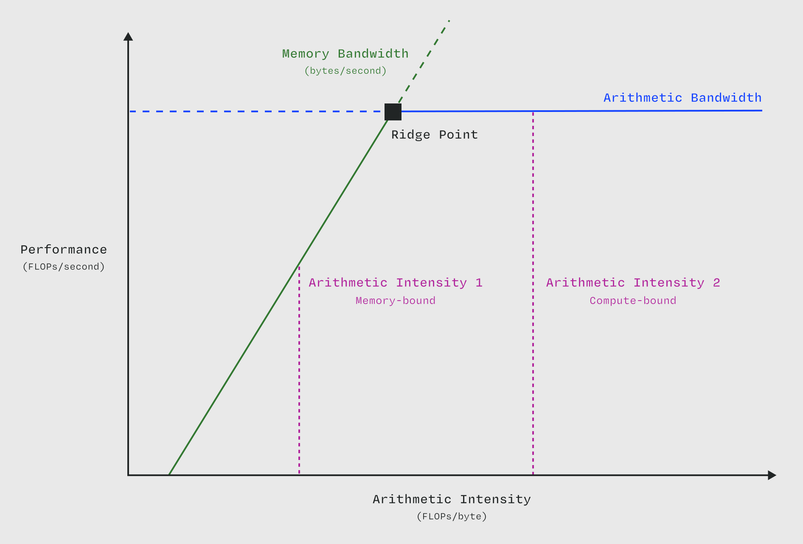

# 什么是算术强度？

算术强度是 [内核 (kernel)](/gpu-glossary/device-software/kernel) 中算术操作与内存操作的比率。

> 在 [屋顶线模型 (roofline model)](/gpu-glossary/perf/roofline-model) 中，操作/算术强度绘制在横轴上。图表改编自 [Williams, Waterman, and Patterson (2008)](https://people.eecs.berkeley.edu/~kubitron/cs252/handouts/papers/RooflineVyNoYellow.pdf)。

高算术强度表明一个 [内核 (kernel)](/gpu-glossary/device-software/kernel) 每加载一个字节会执行许多算术操作。由于现代 GPU 中 [算术带宽 (arithmetic bandwidth)](/gpu-glossary/perf/arithmetic-bandwidth) 与 [内存带宽 (memory bandwidth)](/gpu-glossary/perf/memory-bandwidth) 之间的高比率，最高效的内核具有高算术强度。这意味着当缓解内存 [瓶颈 (bottleneck)](/gpu-glossary/perf/performance-bottleneck) 时，我们通常可以将工作从内存子系统转移到计算子系统，从而节省 [内存带宽 (memory bandwidth)](/gpu-glossary/perf/memory-bandwidth) 但增加算术单元的负载。

例如，压缩 [全局内存 (global memory)](/gpu-glossary/device-software/global-memory) 中的数据可以减少内存流量，因为需要传输的字节数更少，但计算单元必须执行额外的解压缩操作。如果我们之前受限于内存 [瓶颈 (bottleneck)](/gpu-glossary/perf/performance-bottleneck)，这可以提高性能。它还增加了 FLOPs 与移动字节数的比率，从而提高了算术强度。

再举一个例子，[反向传播算法](https://www.nature.com/articles/323533a0) 会产生长期存在的中间体（激活值），这些中间体通常必须在正向传播期间存储在 [全局内存 (global memory)](/gpu-glossary/device-software/global-memory) 中，然后在反向传播期间检索。在某些情况下，只存储这些中间体的一部分然后重新计算其余部分（一种称为 [梯度检查点 (gradient checkpointing)](https://arxiv.org/abs/1604.06174) 的技术）会更快，这增加了算术强度。

因为不同的算法固有地具有不同的操作复杂度和内存复杂度，所以它们在算术强度上的扩展方式也固有地不同。一个具有 O(1) 操作复杂度和 O(N) 内存复杂度的算法具有 O(1/N) 的算术强度扩展，而一个具有 O(N) 操作复杂度和 O(1) 内存复杂度的算法具有 O(N) 的算术强度扩展。

| **内核 (Kernel)**           |    **FLOPs** | **移动字节数 (Bytes Moved)** | **算术强度 (Arithmetic Intensity)** | **算术强度扩展 (Arithmetic Intensity Scaling)** |
| :-------------------------- | -----------: | ---------------------------: | ----------------------------------: | ----------------------------------------------: |
| SAXPY y = ax + y            |           2N |                          8N |                                 1/4 |                                            O(1) |
| 单精度实数 FFT (Single-Precision Real FFT) | 5/2 N log(N) |                         16N |                       5/32 log(N) |                                      O(log(N)) |
| SGEMM                       |         2N^3 |                        6N^2 |                               N/8 |                                            O(N) |

值得注意的是，矩阵乘法在算术强度上呈线性扩展，即 O(N) —— 它的操作复杂度是 O(N^3)，内存复杂度是 O(N^2)。这种有利的扩展使得将矩阵乘法的应用映射到面向算术强度的硬件上变得容易（参见 [关于屋顶线建模的文章](/gpu-glossary/perf/roofline-model) 中的讨论）。这是过去几十年基于矩阵乘法的机器学习算法（如神经网络）成功的关键秘诀之一。

关于算术强度在 Transformer 神经网络中使用的 Bahdanau 注意力机制中的应用讨论，请参阅 Zadouri、Strauss 和 Dao 的 [这篇论文](https://arxiv.org/abs/2505.21487)。

要使工作达到 [计算受限 (compute-bound)](/gpu-glossary/perf/compute-bound)（即超过 [屋顶线模型 (roofline model)](/gpu-glossary/perf/roofline-model) 的脊点）所需的最小算术强度是系统的一个固定参数，因此只需推导一次。近期 NVIDIA 数据中心 GPU 的脊点算术强度见下表。请注意，从 Ampere 到 Hopper 再到 Blackwell [流式多处理器架构 (Streaming Multiprocessor architectures)](/gpu-glossary/device-hardware/streaming-multiprocessor-architecture)，最高脊点已经增加。

| **系统 (计算 / 内存) (System (Compute / Memory))**                                                                                                                               | **[算术带宽 (Arithmetic Bandwidth)](/gpu-glossary/perf/arithmetic-bandwidth) (TFLOPs/s)** | **[内存带宽 (Memory Bandwidth)](/gpu-glossary/perf/memory-bandwidth) (TB/s)** | **[脊点 (Ridge Point)](/gpu-glossary/perf/roofline-model) (FLOPs/byte)** |
| :-------------------------------------------------------------------------------------------------------------------------------------------------------------------------------- | ------------------------------------------------------------------------------------------: | -----------------------------------------------------------------------------: | --------------------------------------------------------------------------: |
| [A100 80GB SXM BF16 TC / HBM2e](https://www.nvidia.com/content/dam/en-zz/Solutions/Data-Center/a100/pdf/nvidia-a100-datasheet-us-nvidia-1758950-r4-web.pdf) |                                                                                        312 |                                                                              2 |                                                                         156 |
| [H100 SXM BF16 TC / HBM3](https://resources.nvidia.com/en-us-gpu-resources/h100-datasheet-24306)                |                                                                                        989 |                                                                           3.35 |                                                                         295 |
| [B200 BF16 TC / HBM3e](https://resources.nvidia.com/en-us-dgx-systems/dgx-b200-datasheet)                     |                                                                                       2250 |                                                                              8 |                                                                         281 |
| [H100 SXM FP8 TC / HBM3](https://resources.nvidia.com/en-us-gpu-resources/h100-datasheet-24306)                |                                                                                       1979 |                                                                           3.35 |                                                                         592 |
| [B200 FP8 TC / HBM3e](https://resources.nvidia.com/en-us-dgx-systems/dgx-b200-datasheet)                     |                                                                                       4500 |                                                                              8 |                                                                         562 |
| [B200 FP4 TC / HBM3e](https://resources.nvidia.com/en-us-dgx-systems/dgx-b200-datasheet)                     |                                                                                       9000 |                                                                              8 |                                                                        1125 |