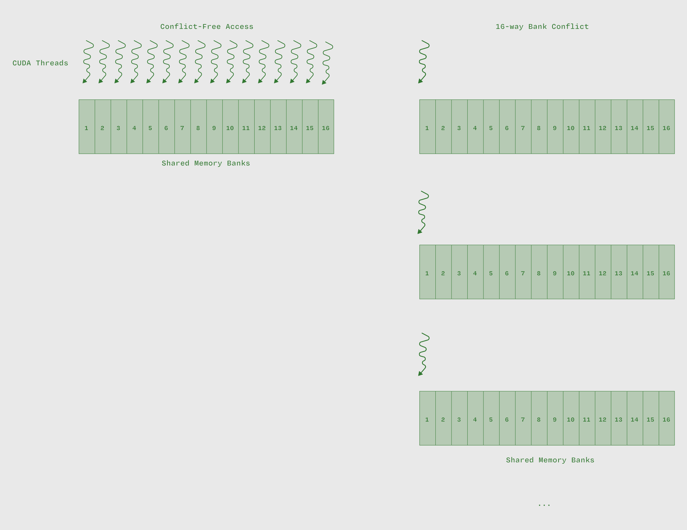

# 什么是存储体冲突？

存储体冲突（bank conflict）指的是当一个 [线程束](/gpu-glossary/device-software/warp) 中的多个 [线程](/gpu-glossary/device-software/thread) 同时请求 [共享内存](/gpu-glossary/device-software/shared-memory) 中同一存储体（bank）但不同地址的数据时出现的现象。


> 当 [线程](/gpu-glossary/device-software/thread) 访问不同的 [共享内存](/gpu-glossary/device-software/shared-memory) 存储体时，访问是并行处理的（左图）。当所有线程都访问同一存储体的不同地址时，访问会被串行化（右图）。

当发生存储体冲突时，不同 [线程](/gpu-glossary/device-software/thread) 的访问会被串行化。这会导致内存吞吐量大幅下降，通常是整数倍降低，无法充分利用 [内存带宽](/gpu-glossary/perf/memory-bandwidth)。

与其他 SRAM 缓存存储器类似，[流式多处理器](/gpu-glossary/device-hardware/streaming-multiprocessor) 中的 [共享内存](/gpu-glossary/device-software/shared-memory) 被组织为多个 “存储体”（bank）。这些存储体可被同时访问，从而提升带宽。

在 GPU 中，有 32 个存储体，每个存储体宽度为 4 字节，连续的 32 位字（注意是 32 位而非 64 位，GPU 设计初衷是适配32位浮点数和整数）会映射到连续的存储体；

```
Address:  0x00  0x04  0x08  0x0C  0x10  0x14  0x18  0x1C  ...  0x7C
Bank:       0     1     2     3     4     5     6     7   ...    31

Address:  0x80  0x84  0x88  0x8C  0x90  0x94  0x98  0x9C  ...  0xFC

Bank:       0     1     2     3     4     5     6     7   ...    31
```

地址相差 32 × 4 = 128 字节的地址会映射到同一存储体。由于 [共享内存](/gpu-glossary/device-software/shared-memory) 的容量大致在 KB 级别，因此多个地址会映射到同一存储体。

若线程访问共享内存数组的连续元素，[线程束](/gpu-glossary/device-software/warp) 中的每个[线程](/gpu-glossary/device-software/thread) 都会命中不同的存储体：

```cpp
__shared__ float data[1024];  // array in shared memory

// all 32 threads access consecutive elements of data
int tid = threadIdx.x;
float value = data[tid];  // address LSBs: 0x00, 0x04, 0x08, ...
```

所有 32 次访问可在单次内存事务中完成，因为每个 [线程](/gpu-glossary/device-software/thread) 都命中了不同的存储体。这在上图的左侧所示。

但如果我们想让 [线程](/gpu-glossary/device-software/thread) 访问行优先存储的 [共享内存](/gpu-glossary/device-software/shared-memory) 数组中某一列（假设每行有 32 个元素），于是我们这样写代码：

```cpp
float value = data[tid * 32];  // address LSBs: 0x000, 0x080, 0x100 ...
// recall: floats are 4 bytes wide
```

如上图右侧所示，所有访问都命中了同一个存储体（Bank 0），因此必须串行处理，导致延迟增加了 32 倍，从大约十几个周期增加到数百个周期。解决此类存储体冲突的方法之一是通过转置 [共享内存](/gpu-glossary/device-software/shared-memory) 数组来解决这个存储体冲突（将行优先存储为列优先)。有关解决存储体冲突的更多技术，请参阅 [GTC 2024的《CUDA编程与性能优化入门》演讲](https://www.nvidia.com/en-us/on-demand/session/gtc24-s62191/)。

需要注意的，如果 [线程](/gpu-glossary/device-software/thread) 访问同一存储体中的相同地址（即读取完全相同的数据），则不会发生冲突——数据可通过多播/广播机制一次性传输给所有线程。