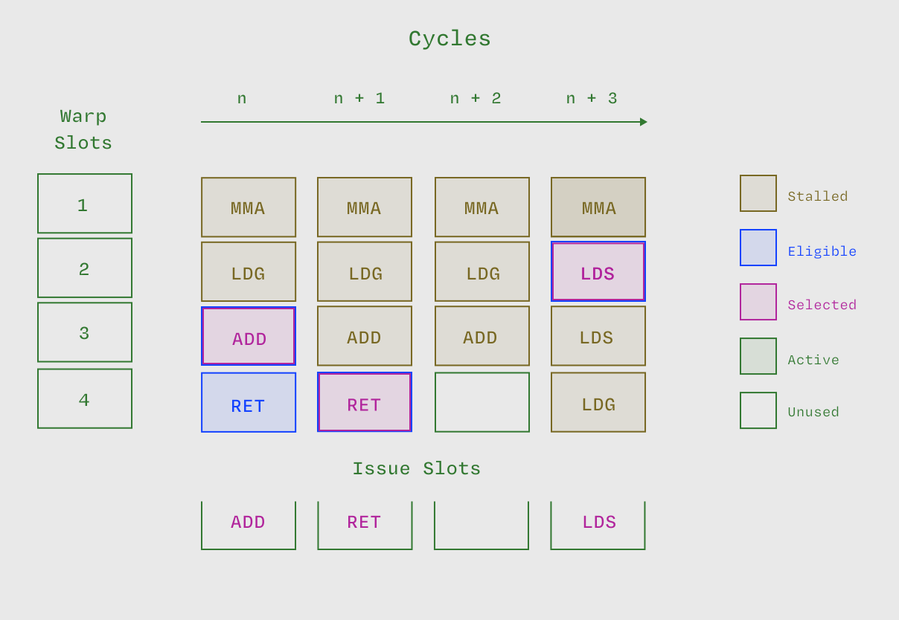

# 什么是占用率？

占用率（Occupancy）是指设备上 [活跃线程束](/gpu-glossary/perf/warp-execution-state) 数量与最大 [活跃线程束](/gpu-glossary/perf/warp-execution-state) 数量的比值。



> 每个周期有4个线程束槽位，共4个时钟周期，因此总共有16（4×4）个线程束槽位，其中15个槽位存在活跃线程束，占用率约为94%。图表灵感来自GTC 2025的 [*CUDA Techniques to Maximize Compute and Instruction Throughput*](https://www.nvidia.com/en-us/on-demand/session/gtc25-s72685/) 演讲。

占用率测量有两种类型：

- **理论占用率**（Theoretical Occupancy）：由内核启动配置和设备能力决定的占用率上限。
- **实际占用率**（Achieved Occupancy）：[内核](/gpu-glossary/device-software/kernel) 执行期间（即 [活动周期](/gpu-glossary/perf/active-cycle)）的实际占用率。

作为 [CUDA编程模型](/gpu-glossary/device-software/cuda-programming-model) 的一部分，[线程块](/gpu-glossary/device-software/thread-block) 中的所有 [线程](/gpu-glossary/device-software/thread) 都被调度到同一个 [流式多处理器 (SM)](/gpu-glossary/device-hardware/streaming-multiprocessor) 上。每个 [SM](/gpu-glossary/device-hardware/streaming-multiprocessor) 都有资源（如 [共享内存](/gpu-glossary/device-software/shared-memory) 中的空间），这些资源必须在 [线程块](/gpu-glossary/device-software/thread-block) 之间进行分配，因此限制了可以在 [SM](/gpu-glossary/device-hardware/streaming-multiprocessor) 上调度的 [线程块](/gpu-glossary/device-software/thread-block) 数量。

让我们来看一个例子。考虑 NVIDIA H100 GPU，它具有以下规格：

```
最大线程束/SM：64
最大块/SM：32
（32位）寄存器：65536
共享内存：228 KB
```

对于一个每 [线程块](/gpu-glossary/device-software/thread-block) 32 个 [线程](/gpu-glossary/device-software/thread)、每 [线程](/gpu-glossary/device-software/thread) 8 个 [寄存器](/gpu-glossary/device-software/registers) 和每 [线程块](/gpu-glossary/device-software/thread-block) 12 KB [共享内存](/gpu-glossary/device-software/shared-memory) 的 [内核](/gpu-glossary/device-software/kernel)，我们最终会受到 [共享内存](/gpu-glossary/device-software/shared-memory) 的限制：

```
64 > 1   = warps/block = 32 threads/block ÷ 32 threads/warp
32 < 256 = blocks/register-file = 65,536 registers/register-file ÷ (32 threads/block × 8 registers/thread)
32       = blocks/SM
19       = blocks/smem = 228 KB/smem ÷ 12 KB/block
```

尽管 [寄存器文件](/gpu-glossary/device-hardware/register-file) 足够大，可以同时支持 256 个 [线程块](/gpu-glossary/device-software/thread-block)，但 [共享内存](/gpu-glossary/device-software/shared-memory) 却不够，因此每个 [SM](/gpu-glossary/device-hardware/streaming-multiprocessor) 只能运行 19 个 [线程块](/gpu-glossary/device-software/thread-block)，对应 19 个[线程束](/gpu-glossary/device-software/warp)。这种情况很常见，存储在 [寄存器](/gpu-glossary/device-software/registers) 中的程序中间结果的大小，远小于需要保留在 [共享内存](/gpu-glossary/device-software/shared-memory) 中的程序 [工作集](https://en.wikipedia.org/wiki/Working_set) 元素的大小。

当没有足够的 [就绪线程束](/gpu-glossary/perf/warp-execution-state) 来 [隐藏指令延迟](/gpu-glossary/perf/latency-hiding) 时，低占用率会损害性能，具体表现为指令 [发射效率](/gpu-glossary/perf/issue-efficiency) 低和 [流水线利用率不足](/gpu-glossary/perf/pipe-utilization)。然而，一旦占用率足以进行 [延迟隐藏](/gpu-glossary/perf/latency-hiding)，进一步增加占用率实际上可能会降低性能。更高的占用率会减少每个 [线程](/gpu-glossary/device-software/thread) 的资源，可能导致 [内核在寄存器上出现瓶颈](/gpu-glossary/perf/register-pressure) 或者降低现代GPU架构旨在利用的 [算术强度](/gpu-glossary/perf/arithmetic-intensity)。

更一般地说，占用率衡量的是 GPU 同时处理其最大并行任务的比例，这在大多数内核中并非优化的固有目标。相反，如果是 [计算受限](/gpu-glossary/perf/compute-bound)，我们希望最大化计算资源的 [利用率](/gpu-glossary/perf/pipe-utilization)；如果是 [内存受限](/gpu-glossary/perf/memory-bound)，我们希望最大化内存资源的利用率。

特别是，在 Hopper 和 Blackwell [架构](/gpu-glossary/device-hardware/streaming-multiprocessor-architecture) 的 GPU 上，高性能 GEMM 内核通常以个位数的百分比占用率运行，因为它们不需要太多的 [线程束](/gpu-glossary/device-software/warp) 就能使 [张量核心](/gpu-glossary/device-hardware/tensor-core) 完全饱和。