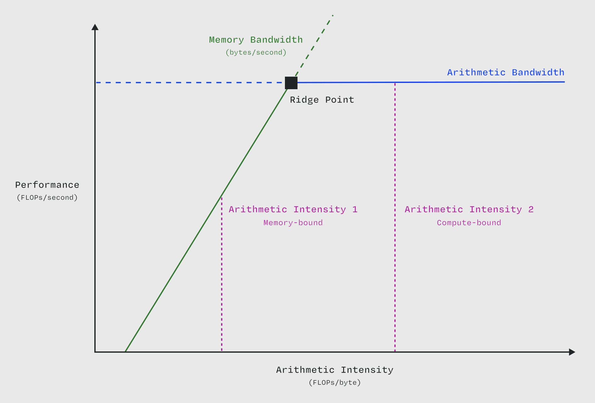

# 什么是性能瓶颈？

瓶子的实际瓶颈会限制液体倒出的速度；系统中类似的性能瓶颈则会限制任务完成的效率。

> 像这样的 [屋顶线图](/gpu-glossary/perf/roofline-model) 用于快速识别吞吐量导向型系统中的性能瓶颈。改编自 [Williams, Waterman, and Patterson (2008)](https://people.eecs.berkeley.edu/~kubitron/cs252/handouts/papers/RooflineVyNoYellow.pdf)。

瓶颈是性能优化的目标。教科书式的优化方法是：

-   确定瓶颈，
-   提升瓶颈直到它不再是瓶颈，然后
-   对新的瓶颈重复此过程。

这种方法已被正式化，例如 [Eliyahu Goldratt 的"约束理论"](https://en.wikipedia.org/wiki/wiki/Theory_of_constraints) ，该理论帮助 [将丰田制造方法传播给全球的制造商](https://www.leanproduction.com/theory-of-constraints/)，[进而影响了软件工程和运营领域](https://youtu.be/1jU7iUr-0xE)。

在 [为 Jane Street 做的这个演讲](https://youtu.be/139UPjoq7Kw?t=1229) 中，Horace He 将在 GPU 上运行的程序 [内核](/gpu-glossary/device-software/kernel) 所做的工作分解为三类：

-   计算（在 [CUDA 核心](/gpu-glossary/device-hardware/cuda-core) 或 [张量核心](/gpu-glossary/device-hardware/tensor-core) 上运行浮点运算）
-   内存（在系统的 [内存层次结构](/gpu-glossary/device-software/memory-hierarchy) 中搬运数据）
-   开销（其他所有操作）

因此，对于 GPU [内核](/gpu-glossary/device-software/kernel)，性能瓶颈主要分为三类：

-   [计算受限](/gpu-glossary/perf/compute-bound) [内核](/gpu-glossary/device-software/kernel)，受限于计算单元（如 [CUDA 核心](/gpu-glossary/device-hardware/cuda-core) 或 [张量核心](/gpu-glossary/device-hardware/tensor-core)）的 [算术带宽](/gpu-glossary/perf/arithmetic-bandwidth)，例如大型矩阵-矩阵乘法，
-   [内存受限](/gpu-glossary/perf/memory-bound) [内核](/gpu-glossary/device-software/kernel)，受限于 [内存子系统的带宽](/gpu-glossary/perf/memory-bandwidth)，例如大型向量-向量乘法，以及
-   [开销受限](/gpu-glossary/perf/overhead) [内核](/gpu-glossary/device-software/kernel)，受限于延迟，例如小型数组操作。

[屋顶线模型](/gpu-glossary/perf/roofline-model) 分析有助于快速确定程序的性能是受限于计算/[算术带宽](/gpu-glossary/perf/arithmetic-bandwidth) 还是 [内存带宽](/gpu-glossary/perf/memory-bandwidth)。

当然，*任何* 资源都可能成为瓶颈。例如，功率输入和热量散发可能会使某些 GPU 的性能低于其理论最大值。参见 [NVIDIA 的这篇文章](https://developer.nvidia.com/blog/nvidia-sets-new-generative-ai-performance-and-scale-records-in-mlperf-training-v4-0/)，其中提到通过将 L2 缓存的功率重新分配给 [流式多处理器 (Streaming Multiprocessor)](/gpu-glossary/device-hardware/streaming-multiprocessor) 实现了 4% 的端到端性能提升；或者参考 [Horace He 的这篇文章](https://www.thonking.ai/p/strangely-matrix-multiplications)，指出矩阵乘法性能会因输入数据通过晶体管开关所需的功率量而变化。但计算和内存是最重要的资源，也是最常见的瓶颈。